# PULL / MERGE REQUEST

## Langkah-langkah

Membuat branch baru dan pindah workspace ke branch baru
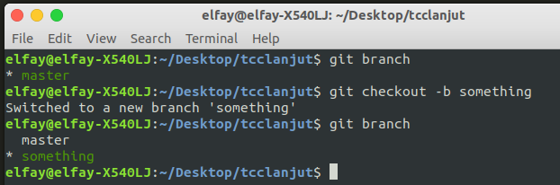
Menambah file dan meng-commit
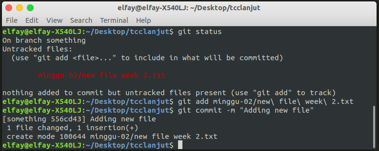
Push ke github pada branch baru
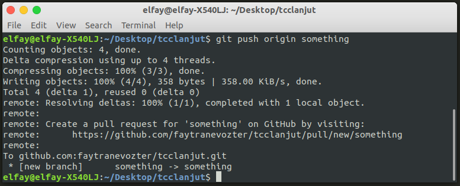
Melakukan Compare & Pull Request
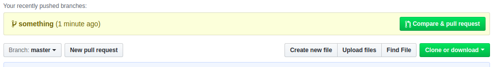
Mengisi form PR
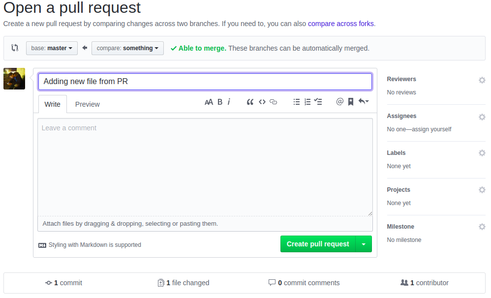
Hasil PR
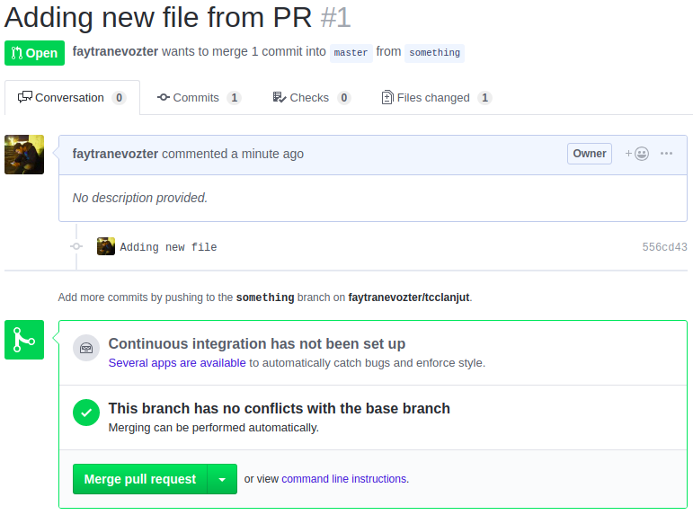
Merge PR
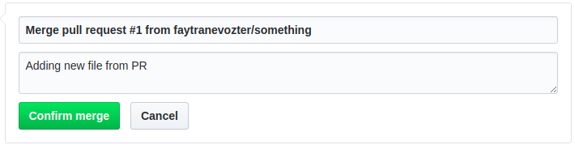
Tampilan Setelah di Merge (MERGED)
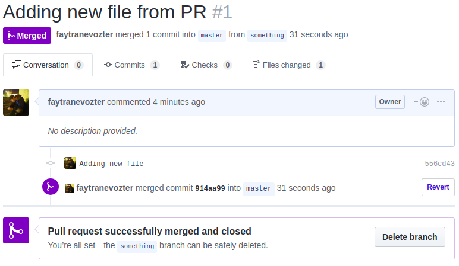

Menambah File Baru untuk melakukan PR lagi
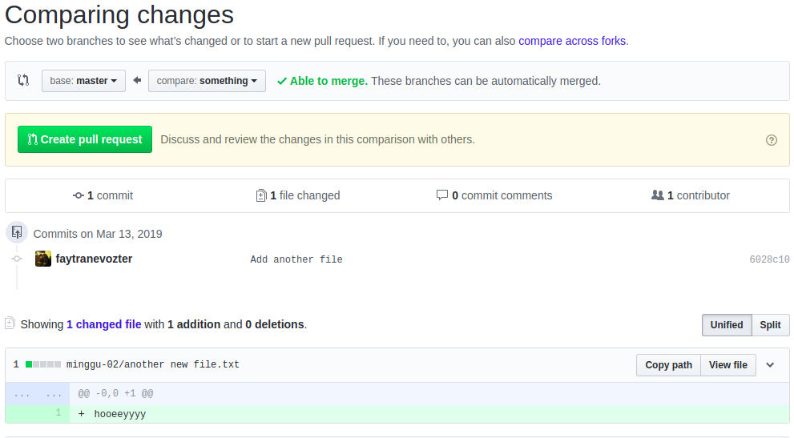
Menolak PR
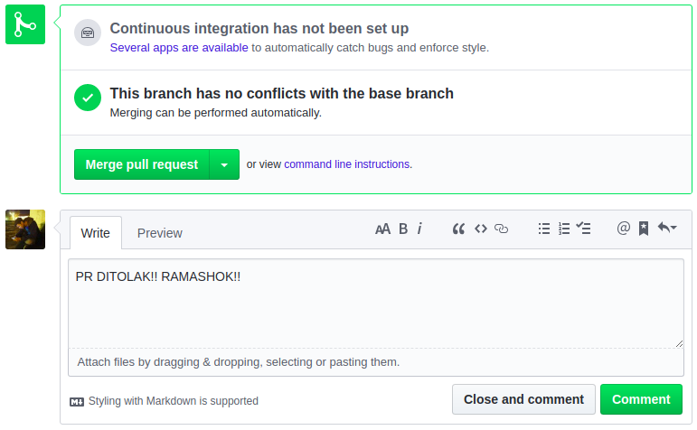
Hasil Setelah Ditolak
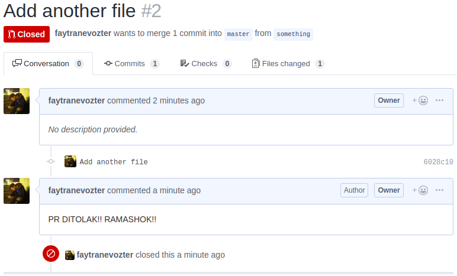
